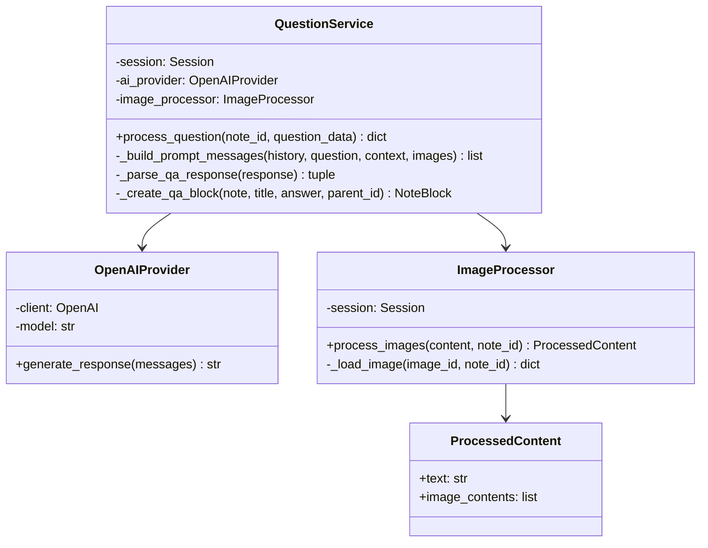

# Question Pipeline - Simplified OOP Design

## Problem Analysis

The `send_question` function has multiple responsibilities that make it hard to test and maintain. We need to refactor it into a cleaner structure without over-engineering.

## Simplified Design Principles

1. **Keep it simple**: Only create classes where they add clear value
2. **Avoid over-abstraction**: No interfaces for single implementations
3. **Pragmatic separation**: Split only the most complex concerns

## Proposed Architecture



## Implementation

### 1. OpenAI Provider (Separate Class)

Encapsulates OpenAI API communication:

```python
# src/backend/services/question/openai_provider.py

import os
from typing import List
from openai import OpenAI

class OpenAIProvider:
    """
    Handles OpenAI API communication.
    Separates AI provider logic from business logic.
    """
    
    def __init__(self, model: str = "gpt-4o-mini"):
        self.client = OpenAI(api_key=os.environ.get("OPENAI_API_KEY"))
        self.model = model
    
    def generate_response(self, messages: List[dict]) -> str:
        """
        Generate response using OpenAI API with streaming.
        
        Args:
            messages: List of message dicts for OpenAI API
            
        Returns:
            Complete response text
        """
        response_stream = self.client.chat.completions.create(
            messages=messages,
            model=self.model,
            stream=True,
        )
        
        full_response = ""
        for chunk in response_stream:
            delta = chunk.choices[0].delta.content
            if delta:
                full_response += delta
        
        return full_response
```

### 2. Image Processor (Separate Class)

Image processing is complex enough to warrant its own class:

```python
# src/backend/services/question/image_processor.py

import re
import base64
import os
from dataclasses import dataclass
from typing import List
from sqlmodel import Session, select
from backend.models.note import NoteImage

@dataclass
class ProcessedContent:
    """Result of image processing."""
    text: str
    image_contents: List[dict]

class ImageProcessor:
    """Handles image reference processing in content."""
    
    def __init__(self, session: Session):
        self.session = session
    
    def process_images(self, content: str, note_id: int) -> ProcessedContent:
        """
        Process @image:X references in content.
        Returns processed text and image data for AI.
        """
        processed_text = content
        image_contents = []
        
        image_refs = re.findall(r'@image:(\d+)', content)
        
        for img_id in image_refs:
            image_data = self._load_image(int(img_id), note_id)
            if image_data:
                image_contents.append(image_data)
                # Replace reference with description
                image = self._get_image_record(int(img_id), note_id)
                if image:
                    processed_text = processed_text.replace(
                        f"@image:{img_id}",
                        f"[Image: {image.original_filename}]"
                    )
        
        return ProcessedContent(
            text=processed_text,
            image_contents=image_contents
        )
    
    def _get_image_record(self, image_id: int, note_id: int) -> NoteImage:
        """Get image record from database."""
        return self.session.exec(
            select(NoteImage).where(
                NoteImage.id == image_id,
                NoteImage.note_id == note_id
            )
        ).first()
    
    def _load_image(self, image_id: int, note_id: int) -> dict:
        """Load and encode image for AI API."""
        try:
            image = self._get_image_record(image_id, note_id)
            if not image or not os.path.exists(image.file_path):
                return None
            
            with open(image.file_path, 'rb') as f:
                image_data = base64.b64encode(f.read()).decode()
            
            return {
                "type": "image_url",
                "image_url": {
                    "url": f"data:{image.mime_type};base64,{image_data}"
                }
            }
        except (ValueError, TypeError, OSError):
            return None
```

### 3. Question Service (Main Class)

All other logic stays in one service class with private methods:

```python
# src/backend/services/question_service.py

from typing import Optional, List, Tuple
from datetime import datetime
from sqlmodel import Session, update
from fastapi import HTTPException

from backend.models.note import Note, NoteBlock, QuestionCreate
from backend.constants import SYSTEM_PROMPT
from backend.services.question.image_processor import ImageProcessor
from backend.services.question.openai_provider import OpenAIProvider

class QuestionService:
    """
    Service for processing questions about notes.
    Handles the complete question-answer flow.
    """
    
    def __init__(self, session: Session, model: str = "gpt-4o-mini"):
        self.session = session
        self.ai_provider = OpenAIProvider(model=model)
        self.image_processor = ImageProcessor(session)
    
    def process_question(self, note_id: int, question_data: QuestionCreate) -> dict:
        """
        Process a question and return a structured Q&A response.
        Main orchestration method.
        """
        # 1. Get and validate note
        note = self._get_note(note_id)
        
        # 2. Process images in question
        processed_content = self.image_processor.process_images(
            question_data.question, 
            note_id
        )
        
        # 3. Get parent note context if specified
        parent_context = ""
        if question_data.parent_note_block_id:
            parent_block = self._get_note_block(note, question_data.parent_note_block_id)
            if parent_block:
                parent_context = f"\n\n---\nNote Context:\n{parent_block.get('content', '')}\n---\n"
        
        # 4. Build prompt messages
        messages = self._build_prompt_messages(
            note_history=note.history,
            question=processed_content.text,
            parent_context=parent_context,
            image_contents=processed_content.image_contents
        )
        
        # 5. Generate AI response
        ai_response = self.ai_provider.generate_response(messages)
        
        # 6. Parse response into title and answer
        title, answer = self._parse_qa_response(ai_response)
        
        # 7. Create and save Q&A block
        qa_block = self._create_qa_block(
            note=note,
            title=title,
            answer=answer,
            parent_note_block_id=question_data.parent_note_block_id
        )
        
        self._save_note_block(note_id, note, qa_block)
        
        return {
            'status': 'ok',
            'qa_block': qa_block.model_dump(mode="json")
        }
    
    # Private helper methods
    
    def _get_note(self, note_id: int) -> Note:
        """Get note by ID or raise 404."""
        note = self.session.get(Note, note_id)
        if not note:
            raise HTTPException(status_code=404, detail="Note not found")
        return note
    
    def _get_note_block(self, note: Note, block_id: int) -> Optional[dict]:
        """Get specific note block from note history."""
        history = note.history or {}
        content = history.get('content', [])
        
        for block in content:
            if block.get('id') == block_id:
                return block
        return None
    
    def _build_prompt_messages(
        self,
        note_history: dict,
        question: str,
        parent_context: str,
        image_contents: List[dict]
    ) -> List[dict]:
        """Build complete message list for OpenAI API."""
        messages = []
        
        # Add system prompt
        messages.append({
            "role": "developer",
            "content": SYSTEM_PROMPT
        })
        
        # Add note history (only actual notes, not questions)
        content = note_history.get('content', [])
        for hist_msg in content:
            if hist_msg.get("is_note", False):
                messages.append({
                    "role": hist_msg.get("role"),
                    "content": hist_msg.get("content")
                })
        
        # Add current question with context
        question_with_context = f"{question}{parent_context}"
        if image_contents:
            user_content = [{"type": "text", "text": question_with_context}] + image_contents
        else:
            user_content = question_with_context
        
        messages.append({
            "role": "user",
            "content": user_content
        })
        
        # Add formatting instruction
        messages.append({
            "role": "developer",
            "content": """Please respond in the following format:
        
First line: A clear, rephrased version of the question for better readability (this will be used as a title)

Then provide your detailed answer below."""
        })
        
        return messages
    
    def _parse_qa_response(self, response: str) -> Tuple[str, str]:
        """
        Parse AI response into title and answer.
        
        Returns:
            Tuple of (title, answer)
        """
        lines = response.strip().split('\n', 1)
        title = lines[0].strip()
        answer = lines[1].strip() if len(lines) > 1 else ""
        return title, answer
    
    def _create_qa_block(
        self,
        note: Note,
        title: str,
        answer: str,
        parent_note_block_id: Optional[int]
    ) -> NoteBlock:
        """Create a Q&A note block from parsed content."""
        timestamp = datetime.utcnow()
        return NoteBlock(
            id=note.get_new_note_block_id(),
            role="assistant",
            content={
                "title": title,
                "answer": answer
            },
            created_at=timestamp,
            updated_at=timestamp,
            is_note=False,
            parent_note_block_id=parent_note_block_id,
            block_type="qa_response"
        )
    
    def _save_note_block(self, note_id: int, note: Note, note_block: NoteBlock) -> None:
        """Save note block to note history."""
        history = note.history or {}
        content = history.get('content', [])
        
        content.append(note_block.model_dump(mode="json"))
        history['content'] = content
        
        self.session.exec(
            update(Note)
            .where(Note.id == note_id)
            .values(history=history)
        )
        self.session.commit()
```

### 4. Updated Service Function

```python
# src/backend/services/notes_service.py

from backend.services.question_service import QuestionService

def send_question(session: Session, note_id: int, question_data: QuestionCreate) -> dict:
    """
    Send a question about a note and get a structured Q&A response.
    Uses QuestionService for clean separation of concerns.
    """
    service = QuestionService(session)
    return service.process_question(note_id, question_data)
```

## File Structure

```
src/backend/services/
├── notes_service.py              # Main service (existing)
├── question_service.py           # NEW: Question processing service
└── question/
    ├── __init__.py
    ├── openai_provider.py        # NEW: OpenAI API wrapper
    └── image_processor.py        # NEW: Image handling
```

## Benefits of This Simplified Design

### 1. **Clear Separation of Concerns**
- `OpenAIProvider`: Handles AI API communication
- `ImageProcessor`: Handles complex image processing logic
- `QuestionService`: Orchestrates the question flow with private helper methods

### 2. **Testability**
Each component can be tested:
```python
def test_openai_provider():
    provider = OpenAIProvider(model="gpt-4o-mini")
    response = provider.generate_response([
        {"role": "user", "content": "Test"}
    ])
    assert isinstance(response, str)

def test_image_processor():
    processor = ImageProcessor(mock_session)
    result = processor.process_images("@image:1", 123)
    assert result.text == "[Image: test.jpg]"

def test_question_service_parse_response():
    service = QuestionService(mock_session)
    title, answer = service._parse_qa_response("Title\nAnswer")
    assert title == "Title"
    assert answer == "Answer"

def test_question_service_build_messages():
    service = QuestionService(mock_session)
    messages = service._build_prompt_messages(
        note_history={'content': []},
        question="Test?",
        parent_context="",
        image_contents=[]
    )
    assert len(messages) == 3  # system, user, formatting
```

### 3. **Maintainability**
- Private methods (`_method_name`) clearly indicate internal helpers
- Each method has a single, clear purpose
- Easy to locate and fix bugs

### 4. **No Over-Engineering**
- Only 3 focused classes instead of 6+
- No unnecessary abstractions
- No interfaces for single implementations
- Methods instead of separate classes for simple operations

### 5. **Easy to Extend**
If needed in the future, you can:
- Add other AI providers (Anthropic, local LLM) by creating similar provider classes
- Extract `_build_prompt_messages()` to a separate class
- Add caching layer to `OpenAIProvider`
- Add retry logic to `OpenAIProvider`
- Switch to async

## Comparison: Before vs After

### Before (Monolithic)
```python
def send_question(session, note_id, question_data):
    # 150+ lines of mixed concerns
    # Image processing
    # Context building
    # AI calling
    # Response parsing
    # Database operations
    # All in one function
```

### After (Clean)
```python
class QuestionService:
    def process_question(self, note_id, question_data):
        # Clear orchestration
        processed = self.image_processor.process_images(...)
        context = self._get_parent_context(...)
        messages = self._build_prompt_messages(...)
        response = self.ai_provider.generate_response(...)
        title, answer = self._parse_qa_response(...)
        block = self._create_qa_block(...)
        self._save_note_block(...)
```

## Testing Strategy

### Unit Tests
```python
# test_openai_provider.py
def test_generate_response_success()
def test_generate_response_with_streaming()

# test_image_processor.py
def test_process_images_with_valid_image()
def test_process_images_with_missing_image()
def test_process_images_with_multiple_images()

# test_question_service.py
def test_parse_qa_response_with_title_and_answer()
def test_parse_qa_response_with_title_only()
def test_build_prompt_messages_with_images()
def test_build_prompt_messages_without_images()
def test_create_qa_block()
```

### Integration Tests
```python
def test_process_question_end_to_end()
def test_process_question_with_parent_context()
def test_process_question_with_images()
```

## Migration Path

1. **Phase 1**: Create `OpenAIProvider` class
2. **Phase 2**: Create `ImageProcessor` class
3. **Phase 3**: Create `QuestionService` class with all methods
4. **Phase 4**: Update `send_question()` to use new service
5. **Phase 5**: Write tests
6. **Phase 6**: Remove old implementation

## Why This Design is Better

### Pragmatic Balance
- **Not too simple**: Avoids 150-line monolithic function
- **Not too complex**: Avoids over-engineering with many classes
- **Just right**: 3 focused classes with clear responsibilities

### Real-World Benefits
1. **Easier debugging**: Clear method boundaries
2. **Easier testing**: Can test each method independently
3. **Easier to read**: Each method fits on one screen
4. **Easier to modify**: Change one method without affecting others

### Future-Proof
If requirements change, you can:
- Extract more classes if needed
- Add new methods easily
- Refactor incrementally
- Keep tests passing throughout

This design follows the principle: **"Make it work, make it right, make it fast"** - we're at the "make it right" stage with a clean, maintainable solution.
