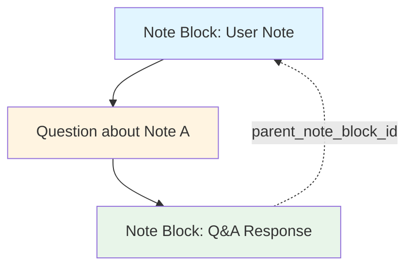

# Question Pipeline Refactor - Technical Specification

## Overview
Refactor the question handling system to:
1. **Replace** the existing `send_note_block` flow for questions (when `isNote=false`)
2. Send only **ONE block** instead of two (user question + bot answer)
3. Link questions to parent note blocks via `parent_note_block_id`
4. Return structured Q&A response with rephrased question title and answer
5. Parse `image_ids` from content dynamically (no storage in model)

## Current Architecture Analysis

### Current Flow (Questions - TO BE REPLACED)
1. **Frontend**: [`NoteManager.js`](../src/frontend/notewindow/NoteManager.js:86) `handleSend()` with `isNote=false`
   - Creates user note block optimistically
   - Calls [`sendNoteBlock()`](../src/frontend/api.js:86) API with `is_note=false`
   - Receives **two blocks**: user question + bot answer
   - Adds both blocks to UI

2. **Backend**: [`notes.py`](../src/backend/api/notes.py:55) `POST /api/coach/notes/{id}/block`
   - Receives [`NoteBlockCreate`](../src/backend/models/note.py:69) with `is_note=false`
   - Calls [`send_note_block()`](../src/backend/services/notes_service.py:79) service
   - Returns two note blocks in response

3. **Service**: [`notes_service.py`](../src/backend/services/notes_service.py:79)
   - ALWAYS adds user block to note history (line 153)
   - ALWAYS returns user block in response (line 223)
   - If `is_note=false`: calls OpenAI and creates assistant response block (line 165-221)
   - Returns array: `[userBlock]` when `is_note=true`, `[userBlock, assistantBlock]` when `is_note=false` (line 223-225)

### Issues with Current Approach
- Questions create **two separate blocks** (user + assistant) - wasteful
- No relationship tracking between questions and the note blocks they reference
- Questions don't have context about which note block they're asking about
- No structured format for question/answer pairs
- `image_ids` stored redundantly when they can be parsed from content

## New Architecture Design

### Conceptual Model


### Data Structure Changes

#### NoteBlock Model Enhancement
Add new fields to [`NoteBlock`](../src/backend/models/note.py:7):
```python
class NoteBlock(BaseModel):
    id: int
    role: Literal["user", "assistant", "system", "developer"]
    content: str | dict  # Allow dict for structured Q&A content
    created_at: Optional[datetime] = None
    updated_at: Optional[datetime] = None
    is_note: bool = False
    parent_note_block_id: Optional[int] = None  # NEW: Links questions to parent note
    block_type: Optional[str] = None  # NEW: "note", "question", "qa_response"
    
    @computed_field
    @property
    def image_ids(self) -> List[int]:
        """Parse image IDs from content dynamically - no storage needed."""
        import re
        if isinstance(self.content, str):
            return [int(img_id) for img_id in re.findall(r'@image:(\d+)', self.content)]
        return []
```

**Note**: `image_ids` is now a computed property that parses `@image:X` references from content on-the-fly.

#### Structured Q&A Content Format
```json
{
  "title": "What is the difference between ser and estar?",
  "answer": "## Ser vs Estar\n\n**Ser** is used for...\n\n**Estar** is used for..."
}
```

### New Question Flow

#### Frontend Changes

**1. Replace `sendBlock()` logic in [`NoteManager.js`](../src/frontend/notewindow/NoteManager.js:125)**

**IMPORTANT**: When `isNote=false`, use the NEW question flow instead of `sendNoteBlock()`:

```javascript
async sendBlock(noteId, message, isNote = false, parentNoteBlockId = null) {
  if (!message.trim()) return;
  if (!noteId) {
    throw new Error('Note ID is required to send a block');
  }

  // Add user block optimistically ONLY for notes
  if (isNote) {
    const newNoteBlockId = this.maxNoteBlockId + 1;
    this.maxNoteBlockId = newNoteBlockId;
    const userNoteBlock = {
      sender: 'user',
      content: message.trim(),
      id: newNoteBlockId,
      is_note: isNote
    };
    this.noteBlocks = [...this.noteBlocks, userNoteBlock];
    this.notifyListeners();
  }

  try {
    if (isNote) {
      // EXISTING: Note flow - returns [userBlock] (only 1 block)
      // Backend always returns userBlock, but for notes there's no assistant response
      const [userNoteBlock] = await sendNoteBlock(noteId, {
        block: message,
        is_note: isNote
      });
      
      // User block already added optimistically above, no need to add again
    } else {
      // NEW: Question flow - returns SINGLE Q&A block
      // REPLACES the old sendNoteBlock with is_note=false
      const qaBlock = await sendQuestion(noteId, {
        question: message,
        parent_note_block_id: parentNoteBlockId
      });

      if (qaBlock) {
        this.noteBlocks = [...this.noteBlocks, qaBlock];
        this.notifyListeners();
      }
    }
  } catch (error) {
    console.error('Error sending block:', error);
    this.noteBlocks = [...this.noteBlocks, {
      sender: 'bot',
      content: 'Error sending block'
    }];
    this.notifyListeners();
    throw error;
  }
}
```

**2. Remove old `handleSendQuestion()` method** from [`NoteManager.js`](../src/frontend/notewindow/NoteManager.js:171) - it's now replaced by the `sendBlock()` logic above.

**3. Update [`api.js`](../src/frontend/api.js:286)**

Replace mock `sendQuestion()` with real implementation:
```javascript
// REPLACE the mock sendQuestion (lines 286-316) with:
export const sendQuestion = async (noteId, data) => {
  try {
    const response = await api.post(`coach/notes/${noteId}/question`, data);
    return response.data.qa_block;
  } catch (error) {
    console.error('Error sending question:', error);
    throw error;
  }
};
```

#### Backend Changes

**1. Create New API Endpoint in [`notes.py`](../src/backend/api/notes.py)**

Add new endpoint after line 58:
```python
@router.post('/{id}/question')
def send_question_endpoint(session: SessionDep, id: int, question_data: QuestionCreate):
    """Send a question about a note block and get a structured Q&A response."""
    return send_question(session, id, question_data)
```

**2. Add New Models in [`note.py`](../src/backend/models/note.py)**

Add after line 78:
```python
class QuestionCreate(BaseModel):
    """Schema for creating a question about a note."""
    question: str
    parent_note_block_id: Optional[int] = None
    # No image_ids field - parsed from content
```

Update `NoteBlock` model (replace existing):
```python
class NoteBlock(BaseModel):
    """Schema representing a message stored in note history."""
    id: int
    role: Literal["user", "assistant", "system", "developer"]
    content: str | dict  # Allow dict for structured content
    created_at: Optional[datetime] = None
    updated_at: Optional[datetime] = None
    is_note: bool = False
    parent_note_block_id: Optional[int] = None
    block_type: Optional[str] = None  # "note", "question", "qa_response"
    
    @computed_field
    @property
    def image_ids(self) -> List[int]:
        """Parse image IDs from content dynamically."""
        import re
        if isinstance(self.content, str):
            return [int(img_id) for img_id in re.findall(r'@image:(\d+)', self.content)]
        return []
```

**3. Implement Service in [`notes_service.py`](../src/backend/services/notes_service.py)**

Add new function after line 229:
```python
def send_question(session: Session, note_id: int, question_data: QuestionCreate) -> dict:
    """
    Send a question about a note and get a structured Q&A response.
    
    REPLACES send_note_block for questions (is_note=false).
    
    Returns a single note block with structured content containing:
    - title: Rephrased question for better readability
    - answer: The answer to the question
    """
    import re
    import base64
    
    # Retrieve the note object
    note = session.get(Note, note_id)
    if not note:
        raise HTTPException(status_code=404, detail="Note not found")

    # Ensure that history has a 'content' key which is a list
    history = note.history or {}
    content = _ensure_history_content(history)

    # Get parent note block context if specified
    parent_context = ""
    if question_data.parent_note_block_id:
        parent_block = get_first(
            content, 
            key=lambda block: NoteBlock.model_validate(block).id == question_data.parent_note_block_id
        )
        if parent_block:
            parent_context = f"\n\n---\nNote Context:\n{parent_block.get('content', '')}\n---\n"

    # Process image references from question content
    processed_question = question_data.question
    image_contents = []
    image_refs = re.findall(r'@image:(\d+)', question_data.question)
    
    if image_refs:
        for img_id in image_refs:
            try:
                image = session.exec(
                    select(NoteImage).where(NoteImage.id == int(img_id), NoteImage.note_id == note_id)
                ).first()
                
                if image and os.path.exists(image.file_path):
                    with open(image.file_path, 'rb') as f:
                        image_data = base64.b64encode(f.read()).decode()
                    
                    image_contents.append({
                        "type": "image_url",
                        "image_url": {
                            "url": f"data:{image.mime_type};base64,{image_data}"
                        }
                    })
                    
                    processed_question = processed_question.replace(
                        f"@image:{img_id}", 
                        f"[Image: {image.original_filename}]"
                    )
            except (ValueError, TypeError):
                continue

    # Prepare the prompt for OpenAI
    question_prompt = f"{processed_question}{parent_context}"
    
    if image_contents:
        user_content = [{"type": "text", "text": question_prompt}] + image_contents
    else:
        user_content = question_prompt

    # Prepare messages for OpenAI API
    api_messages = [
        {
            "role": "developer",
            "content": SYSTEM_PROMPT,
        }
    ]
    
    # Add note history for context (only notes, not previous questions)
    for hist_msg in content:
        if hist_msg.get("is_note", False):  # Only include actual notes
            role = hist_msg.get("role")
            msg_content = hist_msg.get("content")
            api_messages.append({
                "role": role,
                "content": msg_content,
            })
    
    # Add the question with special formatting instruction
    api_messages.append({
        "role": "user",
        "content": user_content
    })
    
    # Add instruction for structured output
    api_messages.append({
        "role": "developer",
        "content": """Please respond in the following format:
        
First line: A clear, rephrased version of the question for better readability (this will be used as a title)

Then provide your detailed answer below."""
    })

    # Call GPT
    response_stream = client.chat.completions.create(
        messages=api_messages,
        model="gpt-4o-mini",
        stream=True,
    )

    # Collect assistant's response
    full_response = ""
    for chunk in response_stream:
        delta = chunk.choices[0].delta.content
        if delta:
            full_response += delta

    # Parse response to extract title and answer
    lines = full_response.strip().split('\n', 1)
    title = lines[0].strip()
    answer = lines[1].strip() if len(lines) > 1 else ""

    # Create structured Q&A note block
    # Note: image_ids will be computed from content automatically
    timestamp = datetime.utcnow()
    qa_block = NoteBlock(
        id=note.get_new_note_block_id(),
        role="assistant",
        content={
            "title": title,
            "answer": answer
        },
        created_at=timestamp,
        updated_at=timestamp,
        is_note=False,
        parent_note_block_id=question_data.parent_note_block_id,
        block_type="qa_response"
    )

    # Append the Q&A block to history
    content.append(qa_block.model_dump(mode="json"))

    # Update DB
    session.exec(
        update(Note)
        .where(Note.id == note_id)
        .values(history=history)
    )
    session.commit()

    return {
        'status': 'ok',
        'qa_block': qa_block.model_dump(mode="json")
    }
```

**Note**: `image_ids` are NOT stored - they're parsed from content when needed via the computed property.

### Frontend UI Changes

**Update [`NoteBlock.jsx`](../src/frontend/notewindow/NoteBlock.jsx)** to handle structured Q&A content:

```javascript
// In the render method, detect structured Q&A content
const renderContent = () => {
  if (block.block_type === 'qa_response' && typeof block.content === 'object') {
    return (
      <div className="qa-response">
        <h3 className="qa-title">{block.content.title}</h3>
        <div className="qa-answer">
          <MarkdownContent content={block.content.answer} />
        </div>
      </div>
    );
  }
  
  // Regular content rendering
  return <MarkdownContent content={block.content} />;
};
```

## Migration Strategy

### Phase 1: Backend Foundation
1. Update [`NoteBlock`](../src/backend/models/note.py:7) model:
   - Add `parent_note_block_id` and `block_type` fields
   - Add `image_ids` as computed property (parse from content)
   - Allow `content` to be `str | dict`
2. Add `QuestionCreate` model (no `image_ids` field)
3. Implement [`send_question()`](../src/backend/services/notes_service.py) service
4. Add new API endpoint `POST /api/coach/notes/{id}/question` in [`notes.py`](../src/backend/api/notes.py)
5. Write tests for new question flow

### Phase 2: Frontend Integration
1. Update [`api.js`](../src/frontend/api.js:286):
   - Replace mock `sendQuestion()` with real implementation
2. Modify [`NoteManager.js`](../src/frontend/notewindow/NoteManager.js:125):
   - Update `sendBlock()` to use `sendQuestion()` when `isNote=false`
   - Remove optimistic user block for questions
   - Handle single Q&A block response
3. Remove old `handleSendQuestion()` method from [`NoteManager.js`](../src/frontend/notewindow/NoteManager.js:171)
4. Update [`NoteBlock.jsx`](../src/frontend/notewindow/NoteBlock.jsx) to render structured Q&A
5. Add CSS styling for Q&A display

### Phase 3: Cleanup & Migration
1. Update any components using the old question flow
2. Consider migration script for existing question blocks (optional)
3. Update documentation

## Testing Requirements

### Backend Tests
- Test question creation with parent note block reference
- Test question without parent reference
- Test structured Q&A response format
- Test question with image references
- Test context extraction from parent note block
- Test `image_ids` computed property

### Frontend Tests
- Test single block creation for questions
- Test Q&A rendering with structured content
- Test question flow without optimistic user block
- Test error handling

## API Contract

### New Endpoint: `POST /api/coach/notes/{id}/question`

**Request:**
```json
{
  "question": "What is the difference between ser and estar?",
  "parent_note_block_id": 5
}
```
Note: No `image_ids` field - parsed from question content automatically.

**Response:**
```json
{
  "status": "ok",
  "qa_block": {
    "id": 12,
    "role": "assistant",
    "content": {
      "title": "Difference Between Ser and Estar",
      "answer": "## Ser vs Estar\n\n**Ser** is used for..."
    },
    "created_at": "2026-01-05T16:45:00Z",
    "updated_at": "2026-01-05T16:45:00Z",
    "is_note": false,
    "parent_note_block_id": 5,
    "block_type": "qa_response",
    "image_ids": []
  }
}
```
Note: `image_ids` is computed from content, not stored.

## Benefits of New Architecture

1. **Single Block Response**: Questions create only ONE block instead of two - cleaner history
2. **Replaces Old Flow**: Completely replaces `send_note_block` with `is_note=false`
3. **Contextual Questions**: Questions are linked to specific note blocks via `parent_note_block_id`
4. **Structured Data**: Q&A responses have clear title/answer separation
5. **Better UX**: Rephrased questions provide better readability
6. **Cleaner History**: Note history includes context about question relationships
7. **Flexible Rendering**: Frontend can render Q&A blocks differently from regular notes
8. **No Redundant Storage**: `image_ids` parsed dynamically from content - no storage needed

## Backward Compatibility

- Existing note blocks without `parent_note_block_id` will continue to work
- Old question blocks (two-block format) will render normally
- New fields (`parent_note_block_id`, `block_type`) are optional
- `image_ids` computed property works for all blocks (old and new)
- Frontend can detect structured content and render accordingly
- No database migration required

## Future Enhancements

1. Add UI to select which note block to ask about
2. Show visual connection between questions and parent notes
3. Filter/group questions by parent note
4. Add question threading (questions about questions)
5. Export Q&A pairs for study materials
